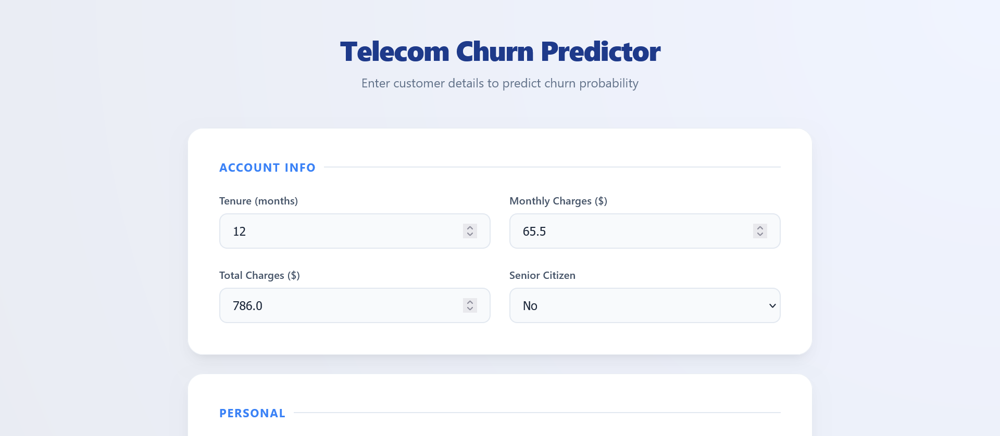
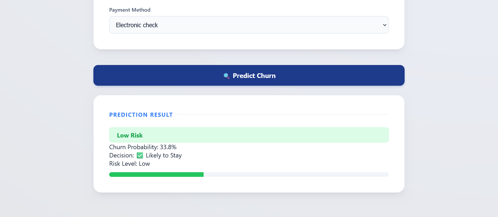
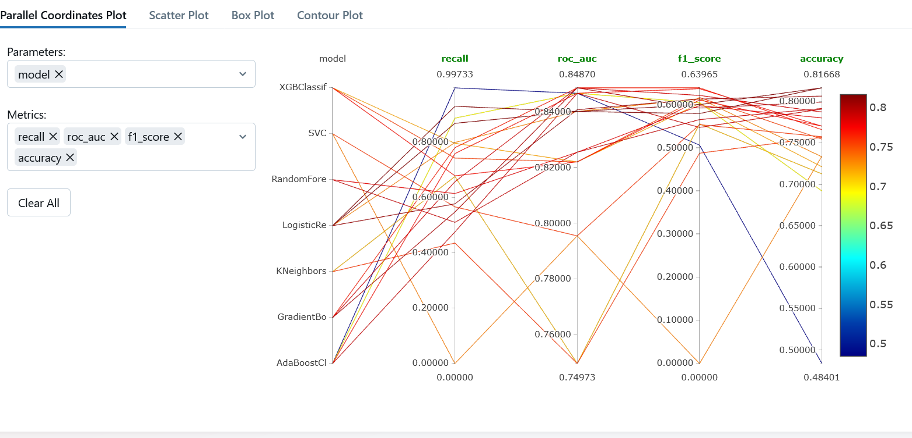

# Telecom-Churn-Prediction
End-to-end machine learning pipeline for predicting telecom customer churn. 
## 🌐 Live Application

👉 https://aiclar23-telecom-churn-prediction.hf.space/

A production-ready machine learning system that predicts customer churn with a strong focus on **recall optimization**, **experiment tracking**, and **real-world deployment**.

---

##  Business Problem

Customer churn is a major challenge in the telecom industry.

* Losing customers = direct revenue loss
* Late detection = no opportunity to retain them

👉 The goal is **early detection of churners**, even at the cost of some false positives.

---

##  ***Solution Overview***

This project delivers:

*  A trained ML model predicting churn probability
*  Optimized decision threshold for business needs
*  Experiment tracking across 20+ models
*  A deployed web application (API + UI)
*  A fully Dockerized pipeline

---

## 1. System Architecture

```
User → Frontend UI → FastAPI → ML Model → Prediction
                         ↓
                    PostgreSQL (data)
```

---

## 🖥️ Application Demo

### 🔹 Input Interface



### 🔹 Prediction Output (Risk + Probability)



---

## 🔬 Machine Learning Workflow

### 1️⃣ Data Engineering

* Data stored in PostgreSQL
* Ingestion pipeline using Python
* Verified with SQL queries

---

### 2️⃣ Exploratory Data Analysis

* Identified key churn drivers
* Encoded categorical variables
* Selected relevant features

---

### 3️⃣ Model Experimentation

Using **MLflow**, I conducted structured experiments across **22 models**:

* Logistic Regression
* Random Forest
* SVM
* XGBoost
* AdaBoost
* KNN
* Gradient Boosting

---

## 2. Experiment Tracking (MLflow)

### 🔹 Model Comparison (Parallel Coordinates)



*Visualization of trade-offs between recall, ROC-AUC, F1-score, and accuracy across multiple models.*

---

### 🔹 Runs Overview


*Each experiment is tracked with parameters, metrics, and model performance.*

---

##  **Key Challenge: Class Imbalance**

The dataset is imbalanced:

* Majority: Non-churn
* Minority: Churn

👉 Accuracy alone is misleading.

---

## 3. Optimization Strategy

### 🔹 Techniques Used

* Class weighting (`class_weight='balanced'`)
* Threshold tuning (0.5 → 0.4 → 0.3)
* Metric prioritization (Recall > Precision)

---

##  ***Final Model Selection***

**Model:** AdaBoost
**Threshold:** 0.4

### ✅ Why this model?

* High recall → captures most churn customers
* Balanced precision → avoids excessive false alarms
* Better trade-off than baseline models

---

## 📈 Results & Insights

* Significant improvement in churn detection vs baseline
* Demonstrated clear precision-recall trade-off
* Built a model aligned with real business priorities

---

##  Tech Stack

* Python
* scikit-learn
* FastAPI
* MLflow
* PostgreSQL
* Docker
* Hugging Face Spaces

---

##  Deployment

* Backend: FastAPI REST API
* Frontend: Interactive UI
* Containerization: Docker
* Hosting: Hugging Face Spaces

---

##  Key Learnings

* Handling imbalanced datasets in real-world scenarios
* Importance of threshold tuning beyond default predictions
* Structuring reproducible ML experiments with MLflow
* Deploying ML models as scalable APIs
* Building full-stack ML systems

---

##  Future Improvements

* Add SHAP for interpretability
* Automate threshold selection (ROC / PR curve)
* Add model monitoring (drift detection)
* Enhance UI/UX

---

## 🤝 Contact

If you're interested in ML engineering, data science, or collaboration, feel free to reach out!

---


